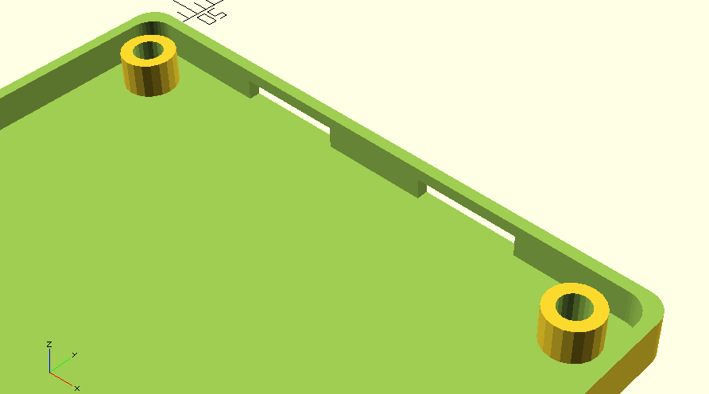

# ProjectBox

This is an [OpenSCAD](https://openscad.org/) library to help with making project boxes for electronics projects.

Note: there are more well-developed libraries for this purpose, such as https://github.com/mrWheel/YAPP_Box. I developed this library organically for my own projects, but it may not be the best for you.

See the [Room133 Project Box](https://selectiveappeal.org/posts/room133-box/) blog post to see an example for how this can be used.

Some devices I've made which include boxes made with this system are:
- [Plant133](https://github.com/chl33/Plant133)
- [Room133](https://github.com/chl33/Room133)

A skeleton project is generated from a template using the included script `generate_project.py`.

One part of the generated skeleton project is a simple GUI which can update views and part configuration on the fly. Here is an example from Room133.

This is the bottom part of the Room133 project box.

 There are holes which tabs on the top part can snap into to hold the parts together, and mounts which the board can be screwed into.

On the top part of the box, here are the tabs which snap into the holes on the bootm

This is one version of the top part for Room133. This box is configurable based on the sensors you intend to use it with.

